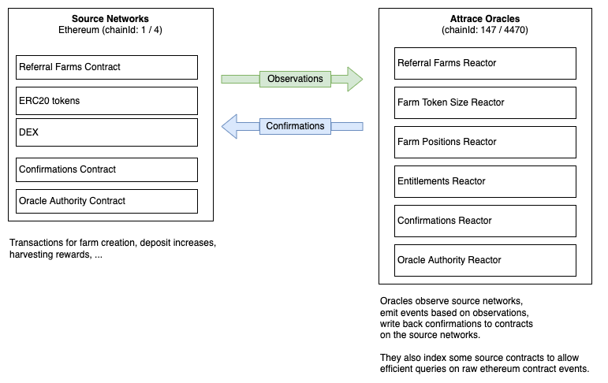

# Connecting dapps with Attrace Referral Protocol

## The Attrace Oracles

The public oracles are observing blockchains like Ethereum for farms, token positions, swaps and other relevant information.

The oracles generate a deterministic side-chain, which can be verifed in a trustless way. This side-chain exposes state and events based on observations.

The oracles periodically commit back their state to the ethereum contracts to allow rewards harvesting and more.

The oracles also share proofs of recommendation (referral proofs).

Oracles are fully reactive to state/event changes on Ethereum, there is no extra configuration in the oracles.

Oracles expose a JSON-RPC interface similar to infura and others.
Querying the oracles to state/events can be done using normal ethereum tooling like ethers.

Overview:   


## Useful to know

### Oracle chain id
Mainnet ethereum has chain id `1`, goerli testnet chain id `5`. 

The oracles internally build a deterministic side-chain following the rules decided by the Attrace DAO, this chain id is `137` for mainnets and `5470` for testnets.

### Farms

Referral farms deposit reward token to be distributed daily for a certain amount for participants that refer a certain referred token.

A "farm" is a visual representation of summing all farm deposits by reward token or by referred token. At the lowest level a farm is a deposit.

The "Farm Hash" encodes sponsor owner, reward token and referred token information into a single hash.

```
function toFarmHash(address sponsor, bytes24 rewardTokenDefn, bytes24 referredTokenDefn) view returns (bytes32 farmHash) {
  return keccak256(abi.encode(block.chainid, sponsor, rewardTokenDefn, referredTokenDefn));
}
```

### Chain Address structure

Chain address is a 24-byte value that encodes into it a 4-byte chain id and a normal 20-byte ethereum address.

Example for a normal evm address:
```
0xc1f04af99fc53dd3b74615ab47d8825eb98b7943
```

Chain Address for chain id 1 (eth-mainnet), hex-encoded `0x00000001`
```
0x00000001c1f04af99fc53dd3b74615ab47d8825eb98b7943
```

## Referral Farms V1 (Ethereum contract)

ReferralFarmsV1 manages the farm definitions, holds reward assets and handles harvesting of rewards after oracle confirmations are finalized.

[Source code on etherscan](https://etherscan.io/address/0xc1f04af99fc53dd3b74615ab47d8825eb98b7943#code)

### Events

Farm existance and configuration:
```
// Emitted whenever a farm is increased. Occurs multiple times per farm.
event FarmExists(address indexed sponsor, bytes24 indexed rewardTokenDefn, bytes24 indexed referredTokenDefn, bytes32 farmHash);

// Dynamic field to control farm behavior. 
event FarmMetastate(bytes32 indexed farmHash, bytes32 indexed key, bytes value);
```

Reward deposit increase/decrease:
```
// Emitted whenever a farm reward is increased
event FarmDepositIncreased(bytes32 indexed farmHash, uint128 delta);

// Emitted when a sponsor _requests_ to withdraw their funds.
// UI's can use the value here to indicate the change to the farm.
// Promoters can be notified to stop promoting this farm.
event FarmDepositDecreaseRequested(bytes32 indexed farmHash, uint128 value, uint128 confirmation);

// Emitted whenever a farm deposit decrease is claimed
event FarmDepositDecreaseClaimed(bytes32 indexed farmHash, uint128 delta);
```

Harvested rewards:
```
// Emitted when rewards have been harvested by an account
event RewardsHarvested(address indexed caller, bytes24 indexed rewardTokenDefn, bytes32 indexed farmHash, uint128 value, bytes32 leafHash);
```


Contract addresses for Referral Farms V1:
```
eth-mainnet (1): 0xc1f04af99fc53dd3b74615ab47d8825eb98b7943
eth-goerli (5): 0x1e1885389b229b036460e2191fbdf0290Bd2baE9
```


## ReferralFarmsV1 Reactor (Oracles)

State query interface:

```
// Returns the last-known reward per confirmation for a farm.
function getLastConfirmationReward(bytes32 farmHash) 
  view returns (uint128);

// Returns the amount of rewards left for a farm.
function getFarmTrackedRewardValue(bytes32 farmHash) 
  view returns (uint128);

// Returns the amount of time in seconds rewards for a farm are locked after being entitled (if the farm specifies a lock time).
function getFarmRewardsLockTime(bytes32 farmHash) 
  view returns (uint64);
```

Events:
```
// Emitted whenever a deposit decrease request is processed.
event FarmDepositDecreased(bytes32 indexed farmHash, uint128 confirmation, uint128 value, bytes32[] proof);
```   

Examples of querying this can be found in [../referralFarming/src/api/oracle/oracle.ts](../referralFarming/src/api/oracle/oracle.ts).

## FarmTokenSizeV1 Reactor (Oracles)

State query interface:

```
// Returns the total position size tracked for a farm
function getFarmTokenSize(bytes32 farmHash, bytes24 referredToken) view returns (uint128);
```

Examples of querying this can be found in [../referralFarming/src/api/oracle/oracle.ts](../referralFarming/src/api/oracle/oracle.ts).
