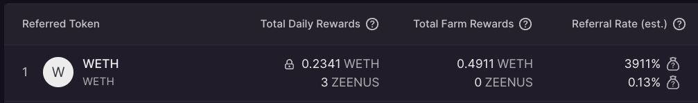

### Running the code example:
```
yarn
yarn start
```

[./src/index.tsx](./src/index.tsx) is the entry point to the UI example.
[./src/app/useData.tsx](./src/app/useData.tsx)includes example to show the farm on the UI with all details. 
The main datapoints can be found at [farms service](https://github.com/attrace/code-examples/blob/develop/referralFarming/src/services/farms.ts)

### Project structure
- api:
  - coingecko - used to get conversation rates for APR
  - discovery - used to get discovery data
  - indexer:
    - indexer.ts - used to find the nearest indexer node to the user
    - referralFarmsV1 - used to get referralFarmsV1 contract events(currently used only FarmExists)
  - oracle - used to get referralFarmsV1Reactor and farmTokenSizeV1Reactor events
- app - React components
- config
- services:
  - rpc
  - farms
  - web3
- types - project types
- utils - reused functions


### Project dependencies:
*Attrace services*
- indexer - indexing blockchain
- discovery - contains contracts addresses, oracle and indexer nodes
- oracle - see [docs](https://attrace.com/about/oracles)

*Third-party*
- [coingecko](https://www.coingecko.com/en/api)


## DataPoints:
- [ERC20 token](https://github.com/attrace/code-examples/blob/22a4c873ab3207cca7907db1cecd0bcb7fa1b7a7/referralFarming/src/api/fetchERC20Tokens.ts) - returns ERC20 token details(Symbol, decimals etc...) 


*Next datapoints returns data for **Referred** token and grouped by **Reward** token(s).*

- [APR](https://github.com/attrace/code-examples/blob/develop/referralFarming/src/services/farms.ts)
- [Daily Rewards](https://github.com/attrace/code-examples/blob/develop/referralFarming/src/services/farms.ts)  
- [Remaining Rewards](https://github.com/attrace/code-examples/blob/develop/referralFarming/src/services/farms.ts)
- [Time farm created](https://github.com/attrace/code-examples/blob/develop/referralFarming/src/services/farms.ts)

### Note

Farm can be created for **Referred** token with different **Reward** tokens:
1. Referred - WETH, Reward - WETH
2. Referred - WETH, Reward - ZEENUS



More info - [here](https://attrace.com/guides/category/referral-farming)

